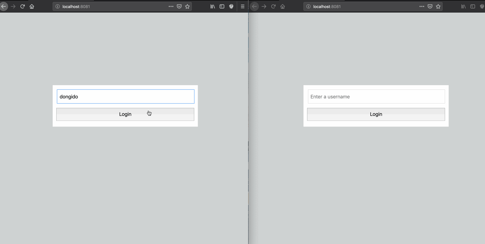
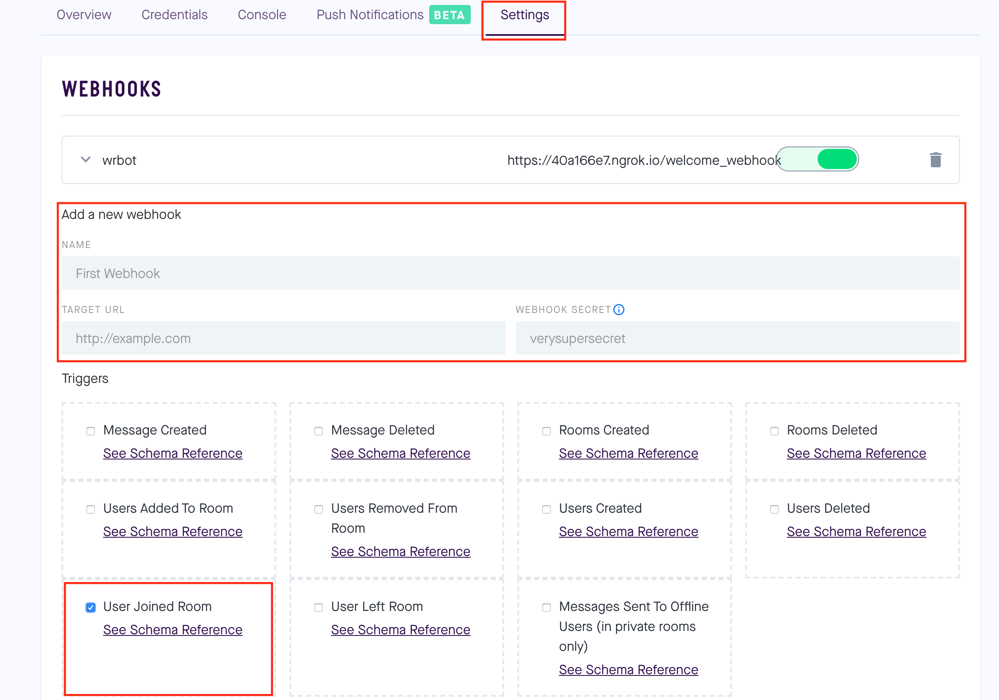

# How to add a welcome actions when users enter the chat functionality using Vue

This is a demo application showing how add Welcome actions to your chatkit app. You can read the tutorial on how it was built [here](https://pusher.com/])



## Prerequisite
 
Install:
- Ngrok
- Node (if you don't have it installed already).

 
## Getting Started

These instructions will get you a copy of the project up and running on your local machine for development and testing purposes.

## How to set up

- Clone the repository to your machine
```
git clone https://github.com/dongido001/chatkit-trbot.git
```

- Create your environment keys:

```
cp .env.example .env

```

- Then, head to your chatkit dashboard and get your:
    - Instance Locator.
    - Secret Key.
    - Test Token Provider Endpoint.

- Update your .env file with th credemtials above.
- On your chatkit console, create a number of users including -`wrbot` which will stand in as user for sending welcome message.
- Also, create some rooms from the console.

## Setup the client

- Install Dependencies:
```
npm install
```

- Run the app

```
npm run serve
```

## Setup the server

Open another terminal, then:

- Go to the server folder:

```
cd server
```

- Install Dependencies:
```
npm install
```

- Run the app

```
node app.js
```

Open up Ngrok and expose the URL:


```
    ./ngrok http 3000
```

Head to your Chatkit Dashboard and enable the webhook:

- Click on the Settings tab
- Fill in the NAME as `wrbot` or any convenient name.
- Fill in the TARGET URL the Ngrok generated URL (eg: https://*.ngrok.io/welcome_webhook). Remember to add the `/welcome_webhook` after the URL.

